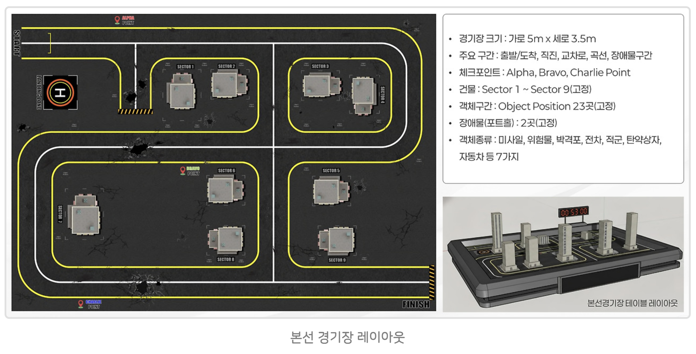
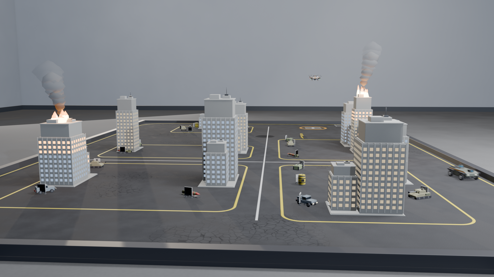
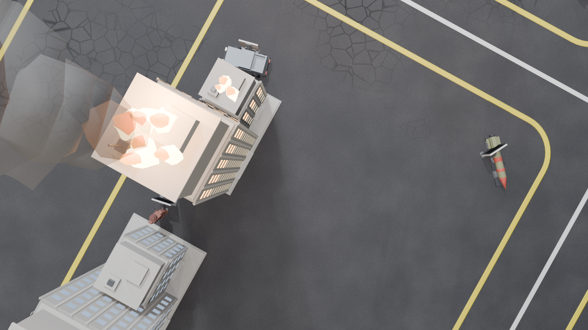
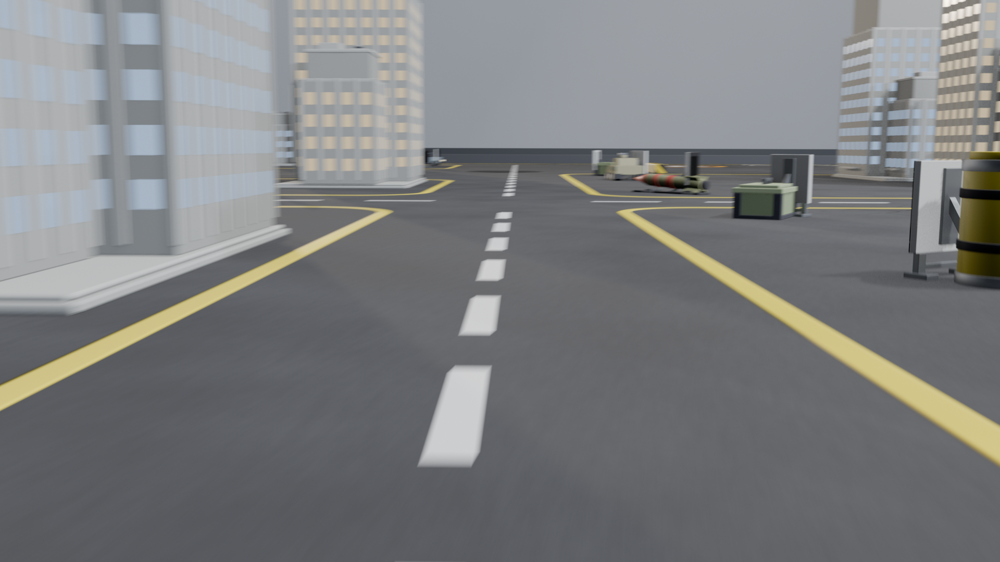
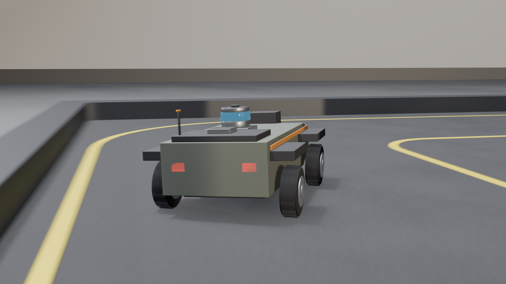

# MAICON-SIM

국방 AI 경진대회(MAICON) 본선 경기장을 Blender로 재현하고, UGV 자율주행과 드론 화재정찰 데모 영상을 산출하는 시뮬레이터.

본선 과제였던 **MUM-T(유무인복합체계) 기반 전장 환경 위험 탐지 및 통합 관제 체계**를 주제로 삼았다. 사람이 조종하는 유인 체계와 자율적으로 움직이는 무인 체계가 협력해 임무를 수행하는 구조를, 지상 무인차량(UGV)의 자율주행과 드론(UAV)의 상공 정찰이 병행되는 장면으로 옮겼다.

---

## 시작점은 트랙 사진 한 장이었다



*주어진 것은 이 한 장이 전부였다 — 트랙 도면, 규격 명세, 실물 테이블 레이아웃*

이 저장소는 하네스 강의 현장에서 만들어진 결과물이다. 출발점은 위 자료와 다음 한 줄이었다.

```
/harness MAICON 국방 AI 경진대회 본선의 시뮬레이션 영상을 Blender MCP로
만들어보고자 합니다. 첨부된 이미지와 관련 내용을 찾아 이를 토대로
시뮬레이션을 만들면 됩니다.
```

역할 분담은 이렇게 나뉘었다.

| 주체 | 한 일 |
|------|------|
| **사람** | 목표와 참고 이미지를 전달했다 |
| **하네스** | 필요한 역할과 작업 절차를 구성했다 |
| **AI 에이전트** | 조사 · 3D 제작 · 배치 · 연출 · 검증을 나눠 수행했다 |

에이전트들은 대회 자료를 조사해 과제 구성을 파악하고, Blender MCP로 사진 속 트랙을 3D 공간에 재구성했다. 트랙 주변에 건물을 세우고 객체를 배치한 뒤, 무인차량이 그 위를 달리는 장면을 시네마틱 영상으로 완성했다.

객체를 탐지하는 데서 끝나는 AI가 아니라, **목표를 이해하고 필요한 도구를 선택해 결과물까지 만들어내는** 방향으로 가는 과정을 그대로 담았다.

### 도면에서 좌표로

도면에는 치수가 없다. 경기장 크기 5 m × 3.5 m 하나만 주어진다. 그래서 도면 이미지의 **픽셀을 월드 좌표로 환산**하는 것이 첫 작업이었다.

```
x_m = (px / 2000) * 5.0 - 2.5
y_m = 1.75 - (py / 1400) * 3.5
```

이렇게 뽑은 좌표는 검산을 통과해야 확정된다 — START가 좌상단이고 FINISH가 우하단인지, ALPHA가 상단이고 CHARLIE가 하단인지, 모든 값이 `|x| ≤ 2.5` `|y| ≤ 1.75` 안에 있는지. 이 검산을 건너뛰면 좌우 반전이나 Y축 부호 오류가 끝까지 살아남아 트랙 전체가 거울상이 된다.

도면에서 읽어낸 고정 요소는 그대로 명세와 일치했다.

| 명세 | 도면 판독 결과 |
|------|---------------|
| 경기장 5 m × 3.5 m | 베이스 5.000 × 3.500 m |
| 체크포인트 Alpha·Bravo·Charlie | 3곳 |
| 건물 Sector 1~9 (고정) | 9곳 |
| **Object Position 23곳 (고정)** | 23곳 → 후기 기준 24곳으로 조정 (아래 제약 참고) |
| 장애물(포트홀) 2곳 (고정) | 2곳 |
| 객체 7가지 | 미사일·위험물·박격포·전차·적군·탄약상자·자동차 |

---

## 결과물

### 데모 영상


*전체 24초 · 13컷 — 드론 이륙 → 체크포인트 통과 → 화재 정찰 → 장애물 회피 → FINISH*

원본 화질은 `output/maicon_demo.mp4`에서 확인할 수 있다.

| 파일 | 사양 | 내용 |
|------|------|------|
| `output/maicon_demo.mp4` | 1920×1080 / 30fps / **24.0초** / 13컷 / 10.85MB | **최종본.** 드론 정찰·화재 건물·장애물 회피 포함 |
| `output/maicon_demo_v1.mp4` | 1920×1080 / 30fps / 24.0초 / 11컷 / 10.97MB | 1차본. UGV 주행만 |
| `docs/demo.gif` | 480×270 / 10fps / 24.0초 / 8.1MB | README 미리보기용 |

최종본의 컷 구성 — 카메라 7대가 13컷을 나눠 맡는다.

| # | 프레임 | 카메라 | 내용 |
|---|--------|--------|------|
| 1 | 1–66 | DroneExt | 오프닝. 헬리패드 저각, f48 드론 수직 이륙 |
| 2 | 67–110 | Slowmo | **ALPHA 통과** (f75) |
| 3 | 111–168 | Orbital | 화재 조감 — 연기 기둥 2개 + 드론 통과 |
| 4 | 169–228 | Chase | 우측 코너 추적 |
| 5 | 229–299 | FPV | 중앙 회랑 1인칭 |
| 6 | 300–355 | **Drone** | **드론 나디르 시점 — 화재 촬영** |
| 7 | 356–395 | Slowmo | **BRAVO 통과** (f364), 최저속 0.29 m/s |
| 8 | 396–459 | **Avoid** | 회피 하이라이트 — 포트홀1 + 배리어1 |
| 9 | 460–499 | Chase | 좌측 회랑 하강 |
| 10 | 500–559 | DroneExt | 드론 + Sector 9 화재 외부 샷 |
| 11 | 560–599 | Slowmo | **CHARLIE 통과** (f568) |
| 12 | 600–655 | Avoid | 포트홀2 회피 + 재가속 |
| 13 | 656–720 | Orbital | FINISH 통과 + 정지 홀드 |

### 스틸 (`output/stills/`)

| | |
|---|---|
|  |  |
| `still_f0140_Orbital` — 화재 2동 + 연기 + 드론 | `still_f0325_Drone` — 드론 나디르, 과제3 재현 |
|  |  |
| `cam_FPV` — 차선·마커·객체가 잡히는 주행 시점 | `cam_Chase` — 바퀴 트레드·센서·후미등 |

나머지: `cam_Orbital`·`cam_Slowmo`(카메라별 검증), `still_f0055_DroneExt`(이륙), `still_f0530_DroneExt`(드론+화재), `still_f0630_Avoid`(회피), `still_f0040/0100/0170`(1차본 시점).

### 검증 자료 (`output/verify/`)

제작 과정에서 실제로 문제를 잡아낸 이미지들이다.

| 파일 | 무엇을 검증했나 |
|------|----------------|
| `topdown_compare.png` / `topdown_v2.png` | [원본 도면](docs/track.png)과 1:1 대조용 직교 톱다운. 도면과 같은 2000×1400으로 렌더해 겹쳐 보면 축 반전과 배치 오차가 바로 드러난다 |
| `fpv_qr_f20/f25/f49`, `fpv_qr_v2` | QR 아군표식이 주행 중 카메라에 잡히는지 — 위치·방향을 세 번 고쳤다 |
| `final_f0325`, `final_f0530` | 최종 mp4에서 추출해 컷 전환 반영 확인 |
| `f0100/f0250/f0450/f0700` | 1차본 컷 전환 확인 |

---

## 재현한 본선 과제

| 과제 | 배점 | 재현 |
|------|------|------|
| 1. 자율주행 — 구간주행 | 15 | START → Alpha → Bravo → Charlie → FINISH, **커브 최소거리 0.00000 m** |
| 1. 자율주행 — 주행시간 | 10 | 720프레임 24초, 평균 0.745 m/s |
| 2. 객체인식 — 아군표식 | 5 | QR 보드 1개, 9패턴 중 4번 |
| 2. 객체인식 — 장애물회피 | 10 | 포트홀 2개. 감속 34~49% + 조향 15° + 좌우 차동 굴림 4.4:1 |
| 2. 객체인식 — 정찰탐지 | 25 | 객체 7종 24개 + ArUco 마커 24개 (마커 ID가 종류 인코딩) |
| 3. 통신보고 — 목표추적 | 10 | 9동 중 화재 2동(Sector 2·9), 드론 나디르 촬영 |
| 3. 통신보고 — 위치보고 | 5 | 체크포인트 통과 실측만 구현 (보고 프로토콜 미구현) |

---

## 하네스

`.claude/`에 이 프로젝트를 만든 **에이전트 팀 구성**이 그대로 들어 있다. 결과물보다 이쪽이 재사용 가치가 클 수 있다.

### 이 도메인의 근본 제약

> **Blender MCP는 살아있는 단일 인스턴스를 조작한다.** 두 에이전트가 동시에 코드를 실행하면 오브젝트 이름 충돌과 컬렉션 경합이 생기고, 어느 쪽이 원인인지 추적할 수 없다.

그래서 하네스를 **작성과 실행의 분리** 위에 세웠다.

- 빌드 에이전트는 `.py` 스크립트만 쓴다 — `tools` 프론트매터에서 Blender MCP를 제외해 **구조적으로 강제**했다
- 실행은 오케스트레이터가 번호 순서대로 하나씩 한다
- `scene-inspector`만 실제 씬을 조회한다

부수 효과가 크다. 씬 전체가 스크립트에서 결정적으로 재생성되므로 Blender가 죽어도 재빌드 비용이 거의 없고, 부분 수정이 "해당 스크립트만 재실행"으로 끝난다.

### 에이전트 7종

모델은 업무 성격으로 골랐다 — 판단 여지가 크면 opus, 절차가 정해져 실행만 남으면 sonnet.

| 에이전트 | 모델 | 담당 | 산출 |
|---------|------|------|------|
| `track-surveyor` | opus | 도면 판독 → 좌표 확정 | `track_spec.json`, `00_common.py` |
| `track-builder` | opus | 노면·차선·포트홀·배리어 | `10`/`20`/`30` |
| `asset-modeler` | opus | 건물·객체·마커·차량·드론 | `40`/`50`/`60`/`70`/`75` |
| `scene-dresser` | **sonnet** | 좌표대로 복제 배치 | `55` |
| `motion-director` | opus | 주행·비행 애니메이션 | `80`/`82` |
| `cinematographer` | opus | 카메라·라이팅·렌더 | `85`/`90`/`95` |
| `scene-inspector` | opus | 스펙↔실물 교차 검수 | `qa/*.md` |

### 스킬 7종

| 스킬 | 역할 |
|------|------|
| `maicon-sim-orchestrator` | 전 과정 조율. 실행 순서·재실행 판별·에러 대응 |
| `blender-mcp-protocol` | 공유 규약 — 멱등 스크립트, 컬렉션·명명, `bpy.ops` 회피, 실행 함정 |
| `track-geometry` | 좌표 스펙과 노면 제작 (+ 도면 판독 원본 `references/`) |
| `procedural-assets` | 건물·객체·마커·차량 프로시저럴 모델링 |
| `ugv-motion` | 주행 경로·속도 곡선·바퀴 동기화 |
| `cinematic-render` | 샷 설계·라이팅·EEVEE 렌더 |
| `scene-qa` | 검수 절차 + 자동 대조 스크립트 `verify_scene.py` |

### 하네스에 기록된 실전 함정

에이전트 정의와 스킬에는 이번 작업에서 **실제로 발목을 잡았던 것들**이 근거와 함께 남아 있다. 몇 가지만 옮기면:

- **에이전트에게 씬 수치를 추론시키지 마라.** 빌드 에이전트는 Blender를 볼 수 없는데 기하 계산을 시키면 역산을 시도하다 멈춘다. 세 에이전트가 같은 이유로 스톨했다. 오케스트레이터가 직접 재서 프롬프트에 넣어야 한다
- **오케스트레이터도 틀린다.** 도면의 "나란한 노란 두 줄"을 도로 양쪽 경계로 읽고 차선 이중선화를 지시했는데, 실은 인접한 두 블록 각각의 경계선이었다. 그대로 갔다면 9개 섹터가 전부 도로를 밟았을 것이다. 에이전트가 위반 값을 조용히 클램프하지 않고 FAIL로 보고하도록 정의해 둔 것이 이를 잡았다
- **`exec` 네임스페이스는 호출 간 유지되지 않는다.** 스크립트가 정의한 함수를 쓰려면 같은 블록에서 다시 로드해야 한다
- **장시간 렌더의 MCP 타임아웃은 실패가 아니다.** Blender 내부에서는 계속 돈다. 재실행하면 파일이 깨진다
- **프레이밍 판단에 뷰포트 스크린샷을 쓰지 마라.** 카메라 프레임 밖까지 보여줘서 "구도가 헐겁다"는 오판을 부른다. 단일 프레임 렌더나 투영 좌표로 판단한다

---

## 씬 구성

- 경기장 5.000 × 3.500 m 실측 스케일, 아스팔트 + 차선 + 균열 데칼 7
- Sector 1~9 타워 (0.36~0.55 m, 창문 2,880칸, 그중 2동 화재)
- 객체 7종(미사일·위험물·박격포·전차·적군·탄약상자·자동차) 24개
- ArUco 마커 24개 — `code >> 5` 로 종류, `code & 0x1F` 로 포지션 복호
- QR 아군표식 1개, 포트홀 2, 배리어 2, 체크포인트 3, 헬리패드
- UGV 0.20 × 0.13 × 0.09 m — 바퀴 4개 독립 회전 + 조향 15° + 차동 굴림
- 드론 0.11 × 0.11 × 0.035 m — 로터 4개(대각 동일 회전), 하방 짐벌
- 실내 환경 — 바닥 12×12 m, 벽 4면, 천장 3.0 m, 조명 패널 6

---

## 실행 방법

### 준비

1. Blender 4.x 이상 (개발·검증은 **5.2 LTS**)
2. [blender-mcp](https://github.com/ahujasid/blender-mcp) 애드온 설치 후 Connect
3. **경로 수정** — 스크립트에 절대 경로가 하드코딩되어 있다:

```bash
grep -rl "/Users/robin/Downloads/maicon-sim" _workspace/scripts/ \
  | xargs sed -i '' "s|/Users/robin/Downloads/maicon-sim|$(pwd)|g"
```

### 빌드

번호 순서대로 실행한다. 각 스크립트가 `00_common.py`를 `exec`로 로드하므로 개별 실행이 가능하다.

| 순서 | 스크립트 | 내용 |
|------|---------|------|
| 00 | `00_common.py` | 씬 초기화, 헬퍼 21종, 스펙 로더 |
| 10 | `10_ground.py` | 베이스, 아스팔트, 포트홀 컷아웃 |
| 20 | `20_markings.py` | 차선, START/FINISH, 헬리패드 |
| 30 | `30_hazards.py` | 포트홀 2, 배리어 2, 균열 |
| 40 | `40_sectors.py` | Sector 1~9 + 화재 2동 |
| 50 | `50_objects.py` | 객체 7종 프로토타입 |
| 60 | `60_markers.py` | ArUco 24 + QR |
| 55 | `55_placement.py` | 배치 (마커 프로토타입이 필요해 60 뒤) |
| 70 · 75 | `70_vehicle.py` · `75_drone.py` | UGV · 드론 |
| 80 · 82 | `80_motion.py` · `82_drone_motion.py` | 주행 · 비행 → 타임라인 JSON |
| 85 | `85_environment.py` | 실내 환경 |
| 90 | `90_camera.py` | 카메라 7대, 13컷, 라이팅 |
| 95 | `95_render.py` | 렌더 설정 (렌더는 시작하지 않음) |

### 렌더

```python
exec(open("<경로>/_workspace/scripts/95_render.py").read())
render_still(150)        # 룩 확인
render_animation()       # 전체 720프레임 (약 25~30분)
```

---

## 좌표 스펙

모든 좌표가 `_workspace/spec/track_spec.json` 하나에 모여 있다. 스크립트는 좌표를 하드코딩하지 않고 이 파일을 읽으므로 **스펙만 고치고 재실행하면 씬이 따라온다.**

- 원점 경기장 정중앙, X 가로(±2.5), Y 세로(±1.75), Z 높이
- 판독 근거와 변경 이력이 `_meta.history`에 남아 있다
- 추정값에는 `confidence: "low"` 표시
- `timeline.json` / `drone_timeline.json` — 애니메이션 실행 시 **실측값으로 생성**된다. 카메라 컷이 이 값을 읽어 자동 정렬된다

## 검수

```python
exec(open("<경로>/.claude/skills/scene-qa/scripts/verify_scene.py").read())
```

스펙과 실제 씬을 교차 대조한다 — 좌표 일치, 개수, 경계 이탈, 노면 정합, Z-파이팅, 이름 충돌, 머티리얼 미할당, 겹침, 애니메이션 궤적. 최종 상태 **59/59 통과**.

---

## 알려진 제약

- **아레나 벽 클리어런스 0.0044 m** — FINISH(2.23, −1.68)에서 경계까지 0.070 m, 차체 반폭 0.065 m. 좌표를 옮기지 않는 한 기하학적 상한이다. 대신 벽에 붙어 가는 거리를 46% 줄였다
- **BRAVO 헤어핀 곡률 0.0873 m** (목표 0.25 m) — 체크포인트가 Sector 6에 가까워 클리어런스와 반경이 정면 충돌한다. 건물 회피를 우선하고 코너 속도를 0.29 m/s로 낮췄다
- **객체 24곳** — 참가자 후기 기준으로 24번째를 추가했다. 다만 [공식 명세](docs/track.png)에는 "Object Position 23곳(고정)"으로 적혀 있어 근거가 약하다. 스펙에 `confidence: low`와 사유를 남겼으니, 되돌리려면 `track_spec.json`의 `objects` 배열에서 `id: 24`만 빼고 `55_placement.py`를 재실행하면 된다
- **드론 이륙 컷 0.63초** — ALPHA 통과가 f75라 리드 +8과 최소 컷 40프레임을 지키면 오프닝에 컷 하나만 들어간다
- 통신보고(위치보고) 프로토콜 미구현. 조향은 바퀴–차체 간격 2 mm 제약으로 15°가 상한

---

## 라이선스

경기장 도면과 과제 구성은 국방 AI 경진대회 공개 자료를 참고했다. 코드는 자유롭게 사용할 수 있다.
